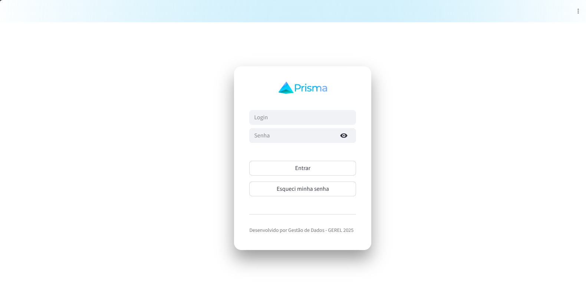
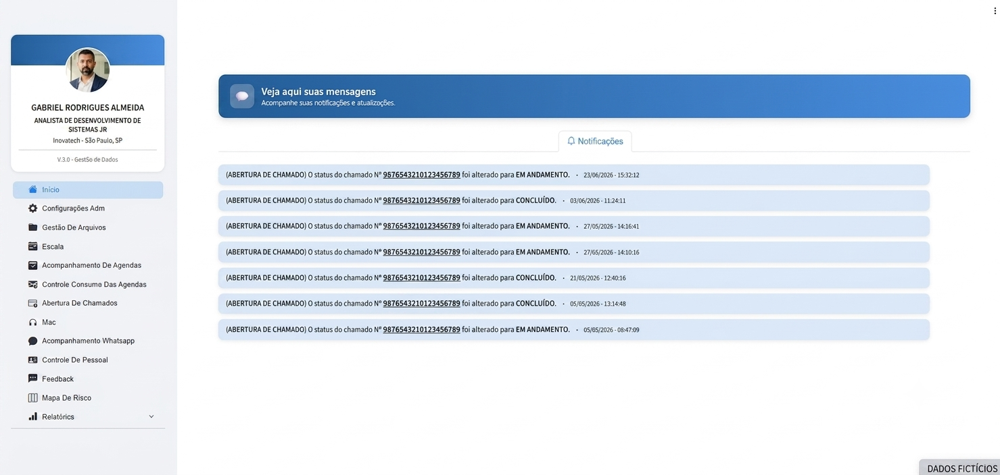

# Prisma

## Sobre

Desenvolvimento de uma plataforma web em Python utilizando Streamlit para automatizar processos internos de gestão operacional. O sistema integra MySql, permite o gerenciamento de equipes, abertura de chamados, troca de turnos, controle de indicadores, dashboards e geração de relatórios em tempo real.
---

## Tecnologias utilizadas

- Python
- Streamlit
- MySql
- Pandas
- HTML
- CSS

---

Resultados:

• Redução de processos manuais.
• Centralização das informações operacionais.
• Maior agilidade na tomada de decisão através de dashboards.

---

## Tela de login

---

## Tela inicial

---
